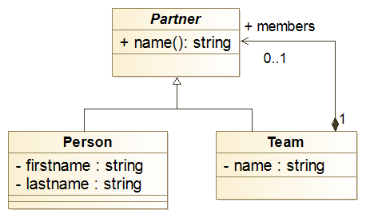

# Example: Teams Hierarchy

We describe below how to load a structure from a JSON file. Let
consider the following UML class diagram that describe a hierarchy of
teams made of either persons or other teams.



## Type-checking

This says nothing on how the data could/should be serialized. We could
for instance, choose to use a YAML file as follows:

```yaml
team:
  name: My Team
  members:
   - given: John
     family: Doe
   - given: James
     family: Bond
   - name: Backup
     members:
      - given: Robert
        family: Roe
```

Using quick-check, we can define the schema that governs such data and
use it to parse, convert and finally obtain a team object, instance of
our own homw-grown classes.

```typescript
const schema = new Grammar();
schema.define("person")
    .as(anObject()
        .with(aProperty("given")
              .ofType("string")
              .withDefault("Unknown"))
        .with(aProperty("familyname").ofType("string")));

schema.define("team")
    .as(anObject()
        .with(aProperty("name").ofType("string"))
        .with(aProperty("members")
              .ofType(anArrayOf(eitherOf("person", "team")))));
```

We can now type check some YAML data, which we read from a file:

```typescript {highlight: \[5]}
const fieContent = fs.readFileSync('./data.yaml', 'utf8');
const data = yaml.safeLoad(fileContents);

try {
    const team = schema.read(data).as("team");

} catch (errors) {
    console.log(errors)

}
```

## Converting objects to home-grown Classes

We can see that the JSON schema underlying our data differs from the
UML class diagram shown previously. Persons' firstname and lastname
are serialized using 'given' and 'family' respectively.

Quick-check let us define convertion rules in order to automatically
convert the object it founds to some specific classes. To do so, we
extend our schema as follows:

```typescript
schema.on("person").apply((data) => {
   return new Person(data.given,
                     data.family)
});

schema.on("team").apply((data) => {
   return new Team(data.name,
                   data.members)
});
```

Now parsing the data will return an a Team object.

We assume that we have encoded these two classes in Typescript as
shown below. We can hook any kind of business logic on our home-grown
classes, for instance, we could define that the `name` of a person is
its lastname concatenated to its lastname.

```typescript
abstract class Partner {
    public abstract get name(): string;
}

class Person extends Partner {
    private _firstname: string;
    private _lastname: string;

    constructor (firstname: string, lastname: string) {
        super();
        this._firstname = firstname;
        this._lastname: lastname;
    }

    public get name(): string {
        return `${this._lastname}, ${this._firstname}`;
    }
}

class Team extends Partner {
    private _name: string;
    private _members: Partner[];

    constructor(name: string, members: Partner[]) {
        super();
        this._name = name;
        this._members = members;
    }

    public get name(): string { return this._name }
}
```
